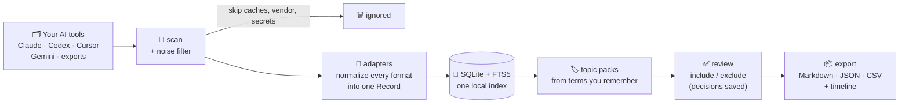
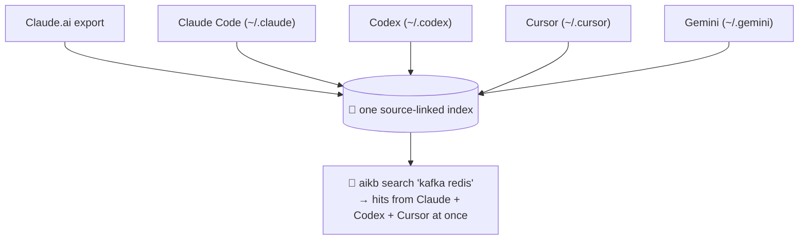
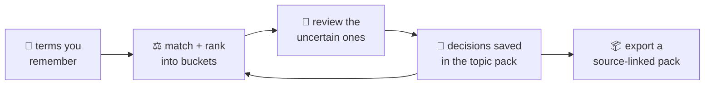

<div align="center">

# 🏺 aikb — AI Knowledge Archaeology

### Turn years of scattered AI chats into one searchable, source-linked memory. Locally.

<p>
  
  
  
  
  
</p>

*Claude · Claude Code · Codex · Cursor · Gemini · exports → one index you can actually search.*

</div>

---

## 🤔 The problem (you have this right now)

```text
        BEFORE                                  AFTER  ·  aikb
  ────────────────────────────          ──────────────────────────────────
  😵  thousands of chats, 6 tools        🔎  one index, one search box
  😵  titles like "New chat"             🏷️  topic: "apace" → 47 linked hits
  😵  the good chat is buried            🔗  every hit → exact file + message
       under an unrelated title          📦  export a clean, sourced pack
  😵  80MB export won't even open        🕰️  timeline: what happened, when
```

The knowledge is in there — the bug fix, the decision, the architecture, the resume-worthy win. It's just **unrecoverable** because it's split across tools, badly titled, and too big to open. `aikb` digs it back out.

---

## ⚙️ How it works



Each tool stores chats in a different messy format. **Adapters** translate them all into one uniform `Record`, so everything downstream — search, topics, export — works the same no matter where the chat came from.

---

## 🔗 One search, every tool



> **Real run:** 11,899 records indexed from Claude + Codex + Cursor in seconds. Searching `ruslana` returned hits from **both Codex and Cursor**, each linked back to the exact file and message.

---

## 🚀 Quickstart

```bash
# clone
git clone https://github.com/rohanbpatel14/aikb && cd aikb

# make `aikb` a command (works even without pip on PATH)
echo 'aikb() { PYTHONPATH="$HOME/path/to/aikb" python3 -m aikb "$@"; }' >> ~/.zshrc
source ~/.zshrc
#   …or install properly:  python3 -m pip install --user -e .

aikb doctor                                              # check environment
aikb index ~/.claude ~/.codex ~/.cursor --out ./idx      # build the index
aikb search ./idx "kafka redis"                          # search across all tools
```

---

## 🏷️ Topic packs — the magic part

You rarely remember exact words from 8 months ago. You remember **fragments**. Topic packs start there.

```bash
aikb topic create ./idx apace --terms "Apace,elevator,GST,quote,RFQ,COP,LOP"
```

```text
Topic: apace
  🟢 high-confidence        42      ← matched several of your terms
  🟡 medium-confidence      18      ← one strong term — worth a look
  🟣 possible buried match   9      ← weak/fuzzy — the gold is often here
  ⚪ likely false positive   0
Next: aikb topic review ./idx apace
```



The loop is the point: **`review` lets you pin in the chats search missed and pin out the noise — and those decisions persist, so recall gets better every run.** (This is exactly the fix for "the chat buried under the wrong title.")

```bash
aikb topic review ./idx apace                 # arrow through, include/exclude
aikb topic terms ./idx apace suggest          # surfaces co-occurring themes to add
aikb topic export ./idx apace --out ./pack --format all
aikb timeline ./idx --topic apace             # reconstruct what happened, when
```

---

## 🧩 Supported sources

| Source | What it reads | Confidence |
|---|---|:--:|
| **Claude.ai export** | `conversations.json`, projects, memories | 🟢 high |
| **Claude Code** `~/.claude` | session transcripts, memories, tasks, commands | 🟢 high |
| **Codex** `~/.codex` | rollout sessions, reasoning, memory/goal SQLite, `AGENTS.md` | 🟢 high |
| **Cursor** `~/.cursor` | agent transcripts, plans, terminals, skills | 🟢 high |
| **Gemini / Antigravity** `~/.gemini` | conversation protobuf, best-effort string recovery | 🟡 low |
| **Generic** | `.md`, `.txt`, `.json(l)`, `.csv`, `.html`, … | 🟠 medium |

Plugin caches, `node_modules`, browser storage, Python stubs, and vendor bundles are pruned automatically. Tool calls and command output are dropped so the **knowledge** stays the signal.

---

## ⚖️ How it compares

There's real prior art here — and aikb isn't trying to beat it head-on. The wedge is **coding-agent coverage + zero setup**, not semantic search (yet).

| Tool | Approach | Best at |
|---|---|---|
| **aikb** | local CLI · keyword + fuzzy · **zero dependencies** · source-linked · topic-pack review | widest **coding-agent** coverage — **Codex, Cursor, Claude Code, Gemini** — with no model download or setup |
| [MyChatArchive](https://github.com/1ch1n/mychatarchive) | local · **semantic embeddings** · **MCP** (ask Claude in-app) | conversational retrieval of ChatGPT/Claude/Grok history |
| ChatVault | local · semantic / RAG (ChromaDB, Ollama) | RAG-style chat over ChatGPT/Claude/Gemini |
| ripgrep / grep | exact text match | when you remember the exact string |
| Obsidian / Notion | manual notes | knowledge you deliberately wrote down |

**Honest take:** aikb trades semantic search for zero dependencies and the broadest coding-agent reach. If you want in-app semantic retrieval, MyChatArchive and ChatVault are excellent. If you want a dependency-free CLI that also indexes Codex and Gemini, that's aikb. (Semantic search + an MCP server are on the roadmap.)

---

## 🔐 Privacy

```text
  ✓ runs entirely on your machine        ✗ no uploads
  ✓ zero runtime dependencies            ✗ no telemetry
  ✓ credentials never indexed            ✗ no LLM calls by default
  ✓ secret shapes redacted from text       (auth.json, .env, keys → skipped)
```

For private chat history, *local-first isn't a feature — it's the requirement.*

---

## 🗺️ Status & roadmap

**v0.1 (now):** scan · index · search · topic packs · review · export · timeline — across Claude, Claude Code, Codex, Cursor, Gemini, generic.

**Next:** ChatGPT export adapter · semantic (embedding) search · optional local-LLM summaries (`decisions.md`, `open-loops.md`) · desktop/web UI · "send topic pack to an AI" one-liner.

---

<div align="center">

Built by **[Rohan Patel](https://github.com/rohanbpatel14)** · MIT License

*Born from a real pain: a knowledge base buried across six AI tools, one chat hidden under an immigration title, and an 80MB export no model could read.*

</div>
