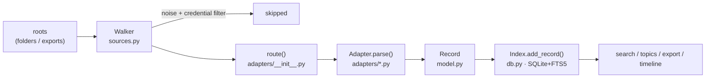
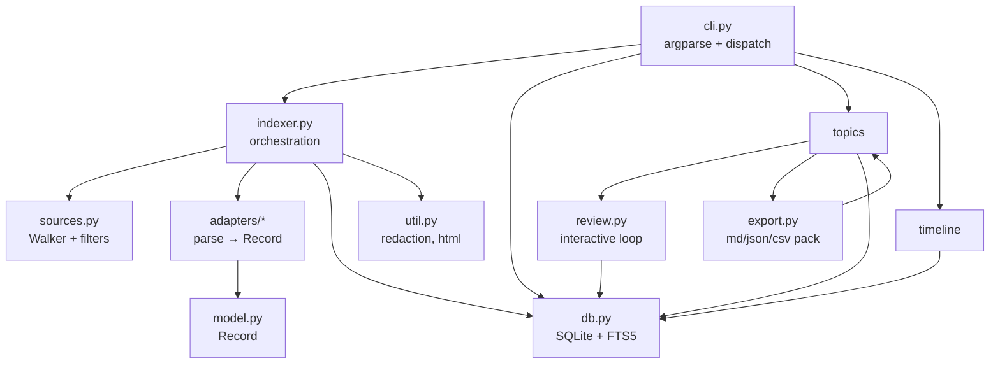
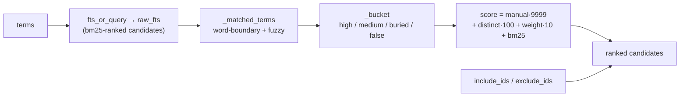

# AIKB — Architecture

Technical reference for how AIKB turns scattered AI chat history into one searchable, source-linked index. Everything here maps to real modules in `aikb/`.

---

## 1. The pipeline

One sentence per stage:
1. **Walk** the roots, pruning noise and credential files (`sources.Walker`).
2. **Route** each surviving file to the first adapter that claims it (`adapters.route`).
3. **Parse** the file into one or more normalized `Record`s (`Adapter.parse`).
4. **Index** each record into SQLite + an FTS5 full-text table (`db.Index`).
5. Everything downstream — `search`, `topic`, `timeline`, `export` — reads only the index.

---

## 2. The Record — the universal interface

Every adapter, no matter how alien the source format, emits the same dataclass (`model.Record`). This is the single most important design decision: **downstream code never knows which tool a message came from.**

| Field | Meaning |
|---|---|
| `record_id` | stable, source-prefixed id (e.g. `claude-export:66dfae38:m4`) |
| `source` | adapter name (`claude-code`, `codex`, …) |
| `source_path` | absolute file the record came from (provenance) |
| `kind` | one of the record kinds below |
| `text` | normalized searchable text |
| `title` | conversation/document title |
| `locator` | message uuid / line number (fine-grained provenance) |
| `created_at` / `updated_at` | ISO-8601 if known |
| `participant` | role / sender (`user`, `assistant`, …) |
| `parent_id` | links a message to its conversation |
| `project` | workspace/project path if known |
| `metadata` | adapter-specific JSON |
| `content_hash` | sha1 of text, for dedup |

**Record kinds:** `conversation`, `message`, `memory`, `project`, `plan`, `task`, `terminal_log`, `attachment`, `document`, `config`, `tool_result`. Each has a `STRUCTURAL_WEIGHT` (in `model.py`) — a conversation/message outranks a loose document when ranking topic matches.

---

## 3. Module map

| File | Responsibility |
|---|---|
| `model.py` | The `Record` dataclass, record kinds, structural weights, id helpers |
| `sources.py` | `Walker` (directory traversal), noise filter, credential skip, source detection |
| `adapters/base.py` | The `Adapter` protocol (`handles` + `parse`) |
| `adapters/_jsonl.py` | Shared JSONL helpers + `content_to_text` (flattens message content, drops tool I/O) |
| `adapters/{claude_code,claude_export,codex,cursor,gemini,generic}.py` | One source family each |
| `adapters/__init__.py` | Adapter registry + `route()` (priority order) |
| `db.py` | `Index`: schema, FTS5, insert, search, sources manifest, topic persistence |
| `indexer.py` | `scan()` and `build_index()` — wire walker → route → parse → store |
| `topics.py` | Topic packs: matching, confidence buckets, term suggestions, CLI handlers |
| `review.py` | Interactive include/exclude loop |
| `export.py` | Source-linked Markdown/JSON/CSV pack + timeline |
| `timeline.py` | Chronological view |
| `cli.py` | `argparse` wiring and command dispatch only |
| `console.py` | Zero-dependency terminal styling (respects `NO_COLOR`) |
| `util.py` | `redact_secrets`, `strip_html`, `mtime_iso` |

---

## 4. Storage layer (`db.py`)

One index = one directory containing `aikb.db` (SQLite). Tables:

- **`records`** — every normalized record (the columns above), with indexes on source/kind/project/created_at/content_hash.
- **`records_fts`** — an FTS5 **external-content** table over `(title, text)`, kept in sync at insert time. Search joins back to `records` by `rowid`.
- **`sources`** — one row per scanned file: `path, adapter, size, mtime, status, n_records`. Powers **incremental indexing** (skip files whose mtime+size are unchanged).
- **`topics`** — saved topic-pack definitions (JSON).
- **`meta`** — schema version, roots, record count, indexed-at.

**FTS query safety:** user queries are never passed raw to FTS5. `fts_and_query` / `fts_or_query` quote each term, neutralizing punctuation and operators (FTS5 would otherwise read `node.js` or `a-b` as syntax).

---

## 5. The topic engine (`topics.py`)

The product's core. A **topic pack** is a persisted definition: `terms`, `exclude_terms`, `accepted_suggestions`, `include_ids`, `exclude_ids`.

`match_topic(index, pack)` runs:

- **Matching** (`_matched_terms`) uses **alnum-boundary regex** so `COP` doesn't match "copy" and `LOP` doesn't match "develop", plus a squashed-string fuzzy pass (`"Apace Systems"` ≈ `apacesystems`).
- **Buckets** (`_bucket`): `high` = ≥2 distinct terms (or manually pinned); `medium` = 1 specific term; `buried` = weak/fuzzy only; `false` = excluded-term hit downgrades a bucket. Constants live in `BUCKETS`.
- **Manual decisions win:** `include_ids` are force-promoted to `high` (even if FTS missed them entirely — they're fetched directly); `exclude_ids` are dropped. These persist in the pack, so **recall improves every run**.
- **Term suggestion** (`suggest_terms`): document-frequency-capped co-occurrence — words frequent in strong matches but present in <50% of them (drops ubiquitous scaffolding like "the"/"code", keeps distinctive themes like "graphql"/"rails").

---

## 6. Review & export

- **`review.py`** surfaces only `medium`/`buried` candidates (high is auto-kept, false auto-dropped), takes `i/e/s/o/a/x/q` keystrokes, and writes decisions back into the pack.
- **`export.py`** emits `README.md`, `timeline.md`, `records.csv`, `records.json`, and `topic.json`. Every entry carries its `record_id` + `source_path` — no orphaned claims.

---

## 7. Design decisions (and why)

| Decision | Why |
|---|---|
| **Zero runtime dependencies** (stdlib + SQLite only) | trivial to install/audit; nothing to phone home — the right default for private chat data |
| **Local-first, no LLM by default** | privacy is the requirement, not a feature; the value is *organizing* the data |
| **Uniform `Record` interface** | adding a source is one isolated file; cross-tool search is free |
| **Keyword + fuzzy, not embeddings (v1)** | explainable, dependency-free, instant; the honest tradeoff is recall vs. semantic tools |
| **Drop tool calls/output from the index** | keep the *knowledge* (dialogue + reasoning) as the signal; tool args are noise |
| **Incremental indexing** | re-running on large dotfolders skips unchanged files (mtime+size) |
| **Credential skip + secret redaction** | a tool that extracts your chats must never leak `auth.json` or a `Bearer` token |

## 8. Known limits

Keyword (not semantic) recall; CLI-only; single-user/single-machine; Gemini protobuf is best-effort string recovery. See the roadmap in the README.
