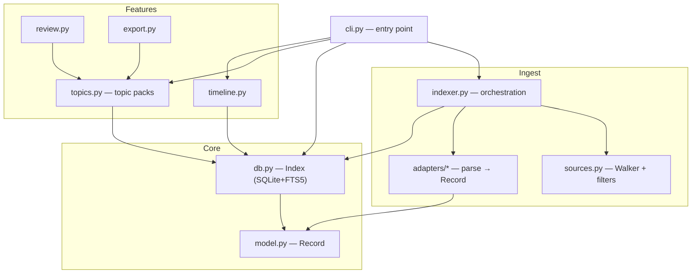

# AIKB — Knowledge-Transfer Map

If you (or anyone) need to pick up this codebase cold — extend it, fix it, or explain it in an interview — start here. This is the guided tour.

---

## The 30-second mental model

> Adapters turn each tool's messy format into one uniform `Record`. Records go into SQLite + FTS5. Everything else (search, topic packs, export) reads that index. Add a new source = add one adapter file. Nothing else changes.

Hold that, and the whole repo falls into place.

---

## The 15-minute reading order

Read these six files, in this order, and you understand AIKB:

1. **`aikb/model.py`** — the `Record`. The contract every adapter fulfills. ~90 lines.
2. **`aikb/adapters/base.py`** — the `Adapter` protocol (`handles` + `parse`). ~25 lines.
3. **`aikb/adapters/claude_export.py`** — the cleanest real adapter. See JSON → Records. ~120 lines.
4. **`aikb/db.py`** — the schema and FTS5. How records are stored and searched. ~270 lines.
5. **`aikb/indexer.py`** — `build_index()` wires walker → route → parse → store. ~120 lines.
6. **`aikb/topics.py`** — the matching algorithm and confidence buckets. The product core. ~360 lines.

Everything else (`review`, `export`, `timeline`, `cli`, `console`, `util`) is presentation or glue you can read on demand.

---

## File-by-file map



| If you want to… | …start in |
|---|---|
| Support a new tool/export format | `adapters/` (+ register in `adapters/__init__.py`) — see [ADAPTERS.md](ADAPTERS.md) |
| Change what counts as "noise" / skipped | `sources.py` (`SEGMENT_IGNORES`, `SENSITIVE_NAMES`) |
| Change the DB schema or search | `db.py` (`_SCHEMA`, `Index.search`) |
| Tune topic ranking / buckets | `topics.py` (`_matched_terms`, `_bucket`, `match_topic`) |
| Change term suggestions | `topics.py` (`suggest_terms`) |
| Change the interactive review UX | `review.py` |
| Change export artifacts | `export.py` |
| Add a CLI command/flag | `cli.py` (+ a `register()` in the feature module) |
| Change redaction / credential rules | `util.py` (`redact_secrets`) + `sources.py` |

---

## Glossary

- **Record** — the normalized unit of knowledge (one message, doc, memory, …). The interface between adapters and everything else.
- **Adapter** — a small class that `handles(path)` and `parse(path) → Iterable[Record]` for one source family.
- **Routing** — for each file, the first adapter (by `priority`, lowest first) whose `handles` returns true wins; `generic` is the last resort.
- **Index** — a directory with `aikb.db` (SQLite + FTS5 + topic/source tables).
- **FTS5** — SQLite's built-in full-text search; provides the inverted index and `bm25` ranking.
- **Topic pack** — a saved, reusable definition of a subject (terms + curated include/exclude decisions).
- **Confidence bucket** — `high` / `medium` / `buried` / `false`, assigned per candidate by `_bucket`.
- **Provenance** — every record/result links to its `source_path` + `locator`, so nothing is an unverifiable claim.
- **Incremental indexing** — re-indexing skips files whose mtime+size are unchanged (tracked in the `sources` table).

---

## Invariants worth not breaking

1. **Adapters only emit `Record`s.** No adapter should know about the DB, search, or topics. Keep them isolated.
2. **All FTS queries go through `fts_and_query` / `fts_or_query`.** Never pass a raw user string to `MATCH` (it'll crash on punctuation — that was a real bug; see the smoke test).
3. **Credentials are skipped before parsing, always** — even with `--no-default-ignores`.
4. **Manual topic decisions persist.** `include_ids`/`exclude_ids` live in the pack and must survive re-runs; that's the whole "recall improves over time" promise.
5. **Tool I/O stays out of the index** (`content_to_text` default) — it's noise that dilutes ranking.

---

## How to verify you understand it

Run the smoke test and read it — it exercises index → search → topic and asserts that `auth.json` is never indexed:

```bash
cd ~/Desktop/aikb && PYTHONPATH=. python3 tests/test_smoke.py   # → "OK — smoke test passed"
```

If you can explain why that test passes, you understand the system end-to-end.
